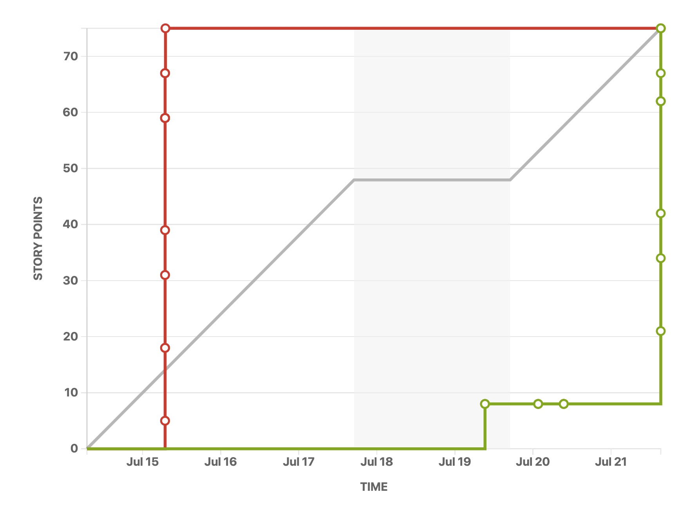

# Sprint 3 Report

Product name: TAPT

Team name: TFRL

Date: 7/20/20

## Actions to stop doing:

- When we start doing time-consuming tasks, make sure everything is prepared and in the correct format. Finding out the problem after the job is completed is a huge waste of time.
- Forget to update scrum board immediately after the completion of the task.

## Actions to start doing:

-  Each member should get started with the tasks early instead of leaving it till the end of the sprint.
-  If there are problems identified by team members, communicate immediately.

## Actions to keep doing:

- Having frequent and efficient scrum meeting

## Work completed/not completed:

We completed all the user stories in our second version of sprint 2 plan, including:

-   As a researcher, I want to generate extra training data so that I can examine its quality.
-   As a researcher, I want to evaluate the augmented data by human examination so that I know the quality of the generated text.
-   As a researcher, I want to evaluate the augmented data by training a Transformer/RNN model so that I know the quality of the generated text.
-   As a researcher, I want high-level abstraction so that I can focus on the data augmentation instead of the model or code.
-   As a researcher, I want to see fully comment code so that I can refer to the source code when I need to.
-   As a researcher, I want to see correctly formatted code so that it is easy to read.
-   As a researcher, I want a fully functional pipeline so that I don't need to assemble the parts manually.

## Work completion rate:

- Total number of user stories completed: 7

- Total number of estimated ideal work hours: 61

- Total number of days: 7

    