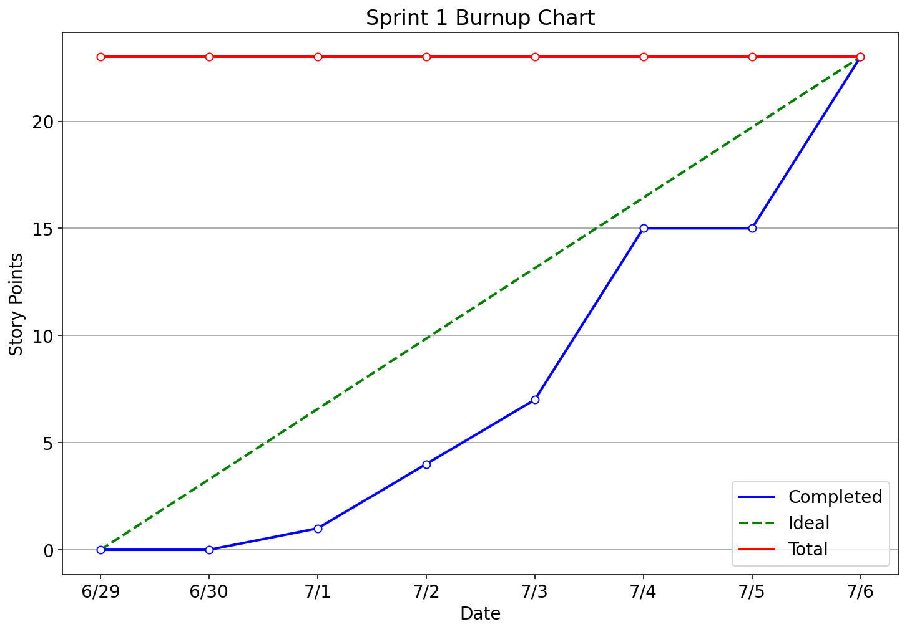

# Sprint 1 Report

Product name: TAPT

Team name: TFRL (Transformers with Reward Learning)

Date: 7/7/20

## Actions to stop doing:

- The team should stop train all Bert and GPT-2 models in Sprint 1, because for some team members, the workload and complexity of completing these tasks alone is too high.
- The team should stop being absent or late, as this slows progress and reduces productivity.
- The team should stop overscheduling when making the plan，because too many unfinished tasks can disrupt the schedule and affect subsequent progress.
- The team should stop allowing daily scrum meetings to go over 15 minutes, because the meetings are less effective that way.

## Actions to start doing:

-  The team should update scrum board and GitHub on time, this will help us track our progress and find out the problem.
- The team should follow the rules of agile development more strictly, because if we don't, there will be a lot of scheduling problems or inefficiencies.
- The team should use a lighter and more efficient distilled model (RoBERTa) because this is a short-term release and there is not much time to repeat trainning the large model.
- When we write the code of pipeline, the team should ensure readability and versatility, because we can avoid repeating steps later when we train the new model with other data sets.

## Actions to keep doing:

- Our team want to keep training GPT-2 model with PPO algorithm to optimize the quality of generation.
- Our team will keep learning GPT-2, model Bert model and agile development.
- Our team will use other data sets to training new model.

## Work completed/not completed:

We completed all the user stories in our second version of sprint 1 plan, included:

- As a researcher, I want a pipeline to load and preprocess the text dataset (IMDb)
- As a researcher, I want to perform the language modeling task using the GPT-2 model so that I can use it for weak-signal controlled generation task
- As a researcher, I want to use a fine-tuned BERT-like model so that I can use it as a supervisor of my GPT-2 generator during PPO training
- As a researcher, I want to build a text classification pipeline so that I can use it to predict the label of a sentence
- As a researcher, I want to build a text generation pipeline so that I can measure generation quality

## Work completion rate:

- Total number of user stories completed: 5
- Total number of estimated ideal work hours: 39
- Total number of days: 7

